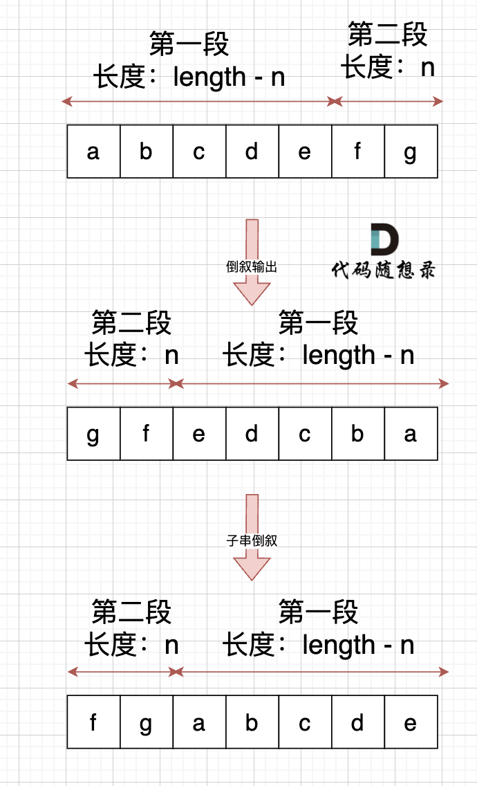
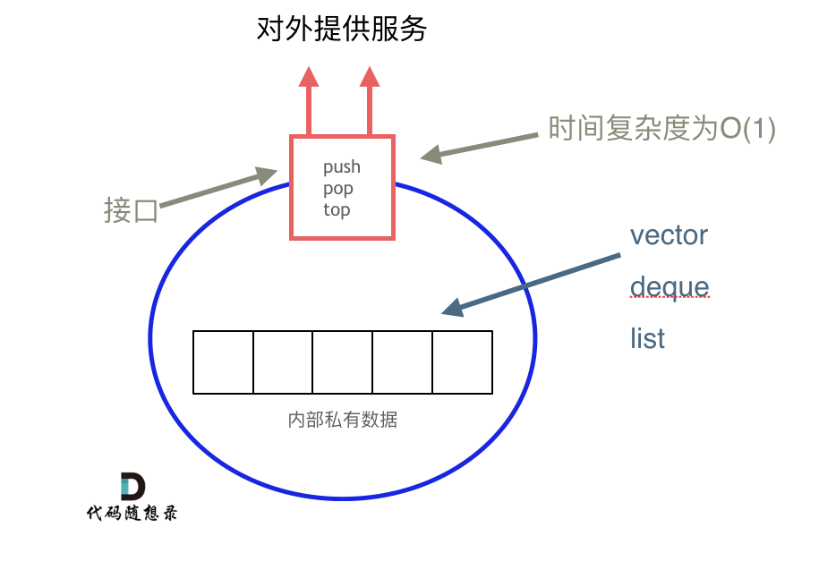
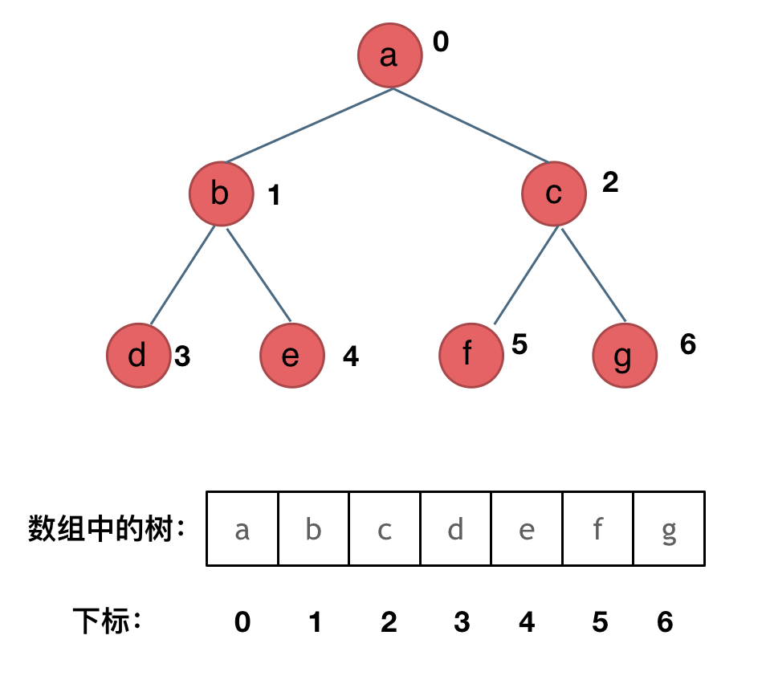
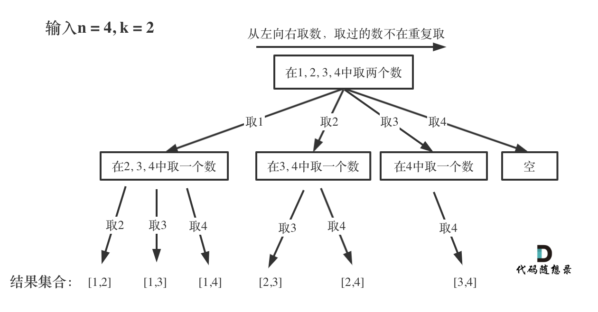
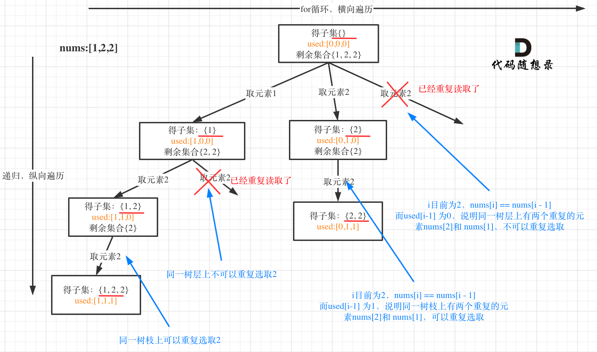
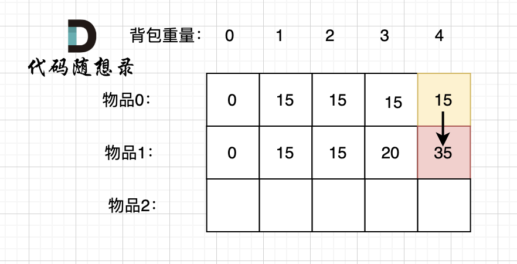

# 代码随想录

## 常见算法

### 1. 快速幂

指数折半：`16=4*4=2²*2²`

```c++
double myPow(double x, int n) {
    double result = 1;
    long long N = n; // 注意-n会超出int限制

    if (N < 0) { // 如果指数小于0，则反转底数x，并且把n变为正数
        x = 1 / x;
        N = -N;
    }

    while (N > 0) // 指数大于0进行指数折半，底数变其平方的操作
    {
        if (N & 1)       // 指数为奇数，power & 1这相当于power % 2 == 1
            result *= x; // 分离出当前项并累乘后保存
        N >>= 1;         // 指数折半,power >>= 1这相当于power /= 2;
        x *= x;          // 底数变其平方
    }

    return result; // 返回最终结果
}
```


## 备注

1. 大小写转换：A + 32 = a
2. 机器人走环形路判定：机器人想要摆脱循环，在一串指令之后的状态，必须是**不位于原点且方向朝北**。

   ```c++
   class Solution {
   public:
       bool isRobotBounded(string instructions) {
           vector<vector<int>> direc{{0, 1}, {1, 0}, {0, -1}, {-1, 0}};
           int direcIndex = 0;
           int x = 0, y = 0;
   
           for (int i = 0; i < instructions.size(); i++) {
               switch (instructions[i]) {
               case 'G':
                   x += direc[direcIndex][0];
                   y += direc[direcIndex][1];
                   break;
               case 'L':
                   direcIndex += 3;
                   direcIndex %= 4;
                   break;
               case 'R':
                   direcIndex++;
                   direcIndex %= 4;
                   break;
               }
           }
   
           return direcIndex != 0 || (x == 0 && y == 0);
       }
   };
   ```

   


## 数组

数组下标都是从0开始的；
数组内存空间的地址是连续的

### 1. 二分查找 

如果说定义 target 是在一个在左闭右开的区间里，也就是[left, right) 。则有如下两点：

- while (left < right)，这里使用 *<* ,因为left == right在区间[left, right)是没有意义的
- if (nums[middle] > target) right 更新为 *middle*，因为当前nums[middle]不等于target，去左区间继续寻找，而寻找区间是左闭右开区间，所以right更新为middle，即：下一个查询区间不会去比较nums[middle]

### 2. 移除元素

- 快指针：寻找新数组的元素 ，新数组就是不含有目标元素的数组
- 慢指针：指向更新 新数组下标的位置


### 3. 有序数组的平方


### 4. 长度最小的子数组（滑动窗口）

窗口就是 满足其和 ≥ s 的长度最小的 连续 子数组。

窗口的起始位置如何移动：如果当前窗口的值大于等于s了，窗口就要向前移动了（也就是该缩小了）。

窗口的结束位置如何移动：窗口的结束位置就是遍历数组的指针，也就是for循环里的索引。

解题的关键在于 窗口的起始位置如何移动，如图所示：


### 5. 螺旋矩阵

​	这里一圈下来，我们要画每四条边，这四条边怎么画，每画一条边都要坚持一致的左闭右开，或者左开右闭的原则，这样这一圈才能按照统一的规则画下来。那么我按照左闭右开的原则，来画一圈，大家看一下：


### 6. 区间和

前缀和的思想是重复利用计算过的子数组之和，从而降低区间查询需要累加计算的次数。

例如，我们要统计 vec[i] 这个数组上的区间和。那么，我们先做累加，即 p[i] 表示 下标 0 到 i 的 vec[i] 累加 之和。

如果，我们想统计，在vec数组上 下标 2 到下标 5 之间的累加和，那是不是就用 p[5] - p[1] 就可以了。


## 链表

数组是在内存中是连续分布的，但是链表在内存中可不是连续分布的

```c++
// 单链表
struct ListNode {
    int val;  // 节点上存储的元素
    ListNode *next;  // 指向下一个节点的指针
    ListNode(int x) : val(x), next(NULL) {}  // 节点的构造函数
};
```

### 1. 移除链表元素 

- 移除头结点：将头结点向后移动一位就可以 head = head -> next 
- 移除其他节点：让节点next指针直接指向下下一个节点 next = next -> next

### 2. 设计链表

- 获取链表第index个节点的数值
- 在链表的最前面插入一个节点
- 在链表的最后面插入一个节点
- 在链表第index个节点前面插入一个节点
- 删除链表的第index个节点

### 3. 反转链表

- 双指针法

  首先定义一个cur指针，指向头结点，再定义一个pre指针，初始化为null。

  然后就要开始反转了，首先要把 cur->next 节点用tmp指针保存一下，也就是保存一下这个节点。

  为什么要保存一下这个节点呢，因为接下来要改变 cur->next 的指向了，将cur->next 指向pre ，此时已经反转了第一个节点了。

  接下来，就是循环走如下代码逻辑了，继续**移动pre和cur指针**（**先pre，后cur**）。

  最后，cur 指针已经指向了null，循环结束，链表也反转完毕了。 此时我们return pre指针就可以了，pre指针就指向了新的头结点。

- 递归法

  本质上就是双指针法

### 4. 两两交换链表中的节点

注意返回头结点时，应该返回dummyhead->next


### 5. 删除链表倒数第N个节点

如果要删除倒数第n个节点，让fast移动n步，然后让fast和slow同时移动，直到fast指向链表末尾。删掉slow所指向的节点就可以了。

### 6. 链表相交

我们求出两个链表的长度，并求出两个链表长度的差值，然后让curA移动到，和curB 末尾对齐的位置，此时我们就可以比较curA和curB是否相同，如果不相同，同时向后移动curA和curB，如果遇到curA == curB，则找到交点。否则循环退出返回空指针。

### 7. 环形链表

- 判断是否有环

  可以使用快慢指针法，分别定义 fast 和 slow 指针，从头结点出发，fast指针每次移动两个节点，slow指针每次移动一个节点，如果 fast 和 slow指针在途中相遇 ，说明这个链表有环。

  

- 如何找到环的入口

  那么相遇时： slow指针走过的节点数为: `x + y`， fast指针走过的节点数：`x + y + n (y + z)`，n为fast指针在环内走了n圈才遇到slow指针， （y+z)为 一圈内节点的个数A。

  因为fast指针是一步走两个节点，slow指针一步走一个节点， 所以 fast指针走过的节点数 = slow指针走过的节点数 * 2：

  ```
  (x + y) * 2 = x + y + n (y + z)
  ```

​	因为要找环形的入口，那么要求的是x，因为x表示 头结点到 环形入口节点的的距离：`x = n (y + z) - y = (n - 1) (y + z) + z` 

​	这就意味着，**从头结点出发一个指针，从相遇节点 也出发一个指针，这两个指针每次只走一个节点， 那么当这两个指针相遇的时候就是 环形入口的节点**。

​	


## 哈希表

哈希碰撞的处理方式：拉链法、线性探测法（tableSize > dataSize）

哈希表的数据结构：数组、set、map【红黑树是一种平衡二叉搜索树】

**需要快速判断一个元素是否出现集合里的时候，就要考虑哈希法**

数组：数值较小，比如字母26个。【Leetcode242：有效的字母异位词】

set：数值比较分散【Leetcode349：两个数组的交集】

map：需要使用 key value结构来存放，key来存元素，value来存下标。【Leetcode1：两数相加】


### 1. 有效的字母异位词

定义一个数组hash[26]来记录字符串a里，26个字母出现的频率，然后再遍历字符串b的时候，只需要将对应的字母做-1就可以。当最后hash[26]数组的元素全为0时，则表明这是字母异位词，return true

### 2. 两个数组的交集


### 3. 求和

1. **两数之和**

   - 为什么会想到用哈希表：需要存下遍历过的元素，然后在遍历过的元素中，查找对应的元素`target-nums[i]`
   - 哈希表为什么用map：需要存放两个元素，key来存元素（查找对象），value来存下标。
   - 本题map是用来存什么的：用来存放遍历过的元素
   - map中的key和value用来存什么的：key存元素，value存下标

   

2. **四数相加**

   1. 首先定义 一个unordered_map，**key放a和b两数之和，value 放a和b两数之和出现的次数**。
   2. 遍历大A和大B数组，统计两个数组元素之和，和出现的次数，放到map中。
   3. 定义int变量count，用来统计 a+b+c+d = 0 出现的次数。
   4. 再遍历大C和大D数组，找到如果 0-(c+d) 在map中出现过的话，就用count把map中key对应的value也就是出现次数统计出来。
   5. 最后返回统计值 count 就可以了

3. **三数之和**

   1. 首先将数组排序，然后有一层for循环，i从下标0的地方开始，同时定一个下标left 定义在i+1的位置上，定义下标right 在数组结尾的位置上。

   2. 接下来如何移动left 和right呢， 如果nums[i] + nums[left] + nums[right] > 0 就说明 此时三数之和大了，因为数组是排序后了，所以right下标就应该向左移动，这样才能让三数之和小一些。

   3. 如果 nums[i] + nums[left] + nums[right] < 0 说明 此时 三数之和小了，left 就向右移动，才能让三数之和大一些，直到left与right相遇为止。

   - 关键在于**去重**：①对i进行去重`nums[i] == nums[i-1]` 

     ​		         ②在收获结果后，对left和right进行去重`nums[right] == nums[right - 1]`；`nums[left] == nums[left+1]`

4. **四数之和**

   四数之和的双指针解法是两层for循环nums[k] + nums[i]为确定值，依然是循环内有left和right下标作为双指针，找出nums[k] + nums[i] + nums[left] + nums[right] == target的情况，三数之和的时间复杂度是O(n^2)，四数之和的时间复杂度是O(n^3) 。

## 字符串

### 1. 反转字符串

双指针指向头尾，然后同时向中间移动。

**翻转字符串里的单词**：先对字符串整体翻转，再对单词进行翻转

**右旋转字符串**：先对字符串整体翻转，再对两个子串里的的字符在翻转



### 2. 替换数字

数组填充类的问题，考虑先预先给数组扩容带填充后的大小，然后在从后向前进行操作。

这么做有两个好处：

1. 不用申请新数组。
2. 从后向前填充元素，避免了从前向后填充元素时，每次添加元素都要将添加元素之后的所有元素向后移动的问题。

### 3. 字符串相乘（FFT卷积）

*num*1 和 *num*2 的乘积的长度为 *m*+*n*−1 或 *m*+*n*因此创建长度为 m+n 的数组 ansArr 用于存储乘积。

对于任意 `0≤i<m` 和 `0≤j<n`，`num1[i] × num 2[j]`的结果位于 `ansArr[i+j+1]`，如果 `ansArr[i+j+1]`≥10，则将进位部分加到 `ansArr[i+j]`。

最后，将数组 ansArr 转成字符串，如果最高位是 0 则舍弃最高位。

### 4. KMP算法 O(n+m)

字符串匹配类题目：在文本串中查找是否出现过模式串。暴力解法：O(m*n)

KMP的主要思想是**当出现字符串不匹配时，可以知道一部分之前已经匹配的文本内容，可以利用这些信息避免从头再去做匹配了**。

- 前缀是指不包含最后一个字符的所有以第一个字符开头的连续子串；
- 后缀是指不包含第一个字符的所有以最后一个字符结尾的连续子串

- 如何求next数组（前缀表）

  - 初始化、前后缀不相同、前后缀相同、更新next

  

- 如何利用前缀表实现匹配

  

字符串匹配类题目：文本串是否由重复的子串组成。

**当 最长相等前后缀不包含的子串的长度 可以被 字符串s的长度整除，那么不包含的子串 就是s的最小重复子串**

## 栈与队列

### 1. 基础理论 

栈stack（先进后出）、队列queue（先进先出）

- 栈是容器吗？

  **栈是以底层容器完成其所有的工作，对外提供统一的接口，底层容器是可插拔的（也就是说我们可以控制使用哪种容器来实现栈的功能）。**而在STL（c++标准库）中，栈和队列都不被归类为容器，而被归类为container adapter（容器适配器）

- STL中，stack是如何实现的？

  栈的底层实现可以是vector，deque，list。

  **常用的SGI STL，如果没有指定底层实现的话，默认是以deque为缺省情况下栈的底层结构。**

  ```c++
  std::stack<int, std::vector<int> > third;  // 使用vector为底层容器的栈
  ```

  

- stack 提供迭代器来遍历stack空间么？

  同样不允许有遍历行为，不提供迭代器

**用栈实现队列**：额外设置一个“出栈”，将“进栈”中的元素都push到“出栈”中，然后在“出栈”中pop元素

**用队列实现栈**：一个队列在模拟栈弹出元素的时候只要将队列头部的元素（除了最后一个元素外） 重新添加到队列尾部，此时再去弹出元素就是栈的顺序了。

### 2. 有效的括号

1. 第一种情况，字符串里左方向的括号多余了 ，所以不匹配。
2. 第二种情况，括号没有多余，但是 括号的类型没有匹配上。
3. 第三种情况，字符串里右方向的括号多余了，所以不匹配。

考虑将字符串里的括号push进去，遇到左括号，则放入右括号，最后弹出进行匹配。

1. 第一种情况：已经遍历完了字符串，但是栈不为空，说明有相应的左括号没有右括号来匹配，所以return false
2. 第二种情况：遍历字符串匹配的过程中，发现栈里没有要匹配的字符。所以return false
3. 第三种情况：遍历字符串匹配的过程中，栈已经为空了，没有匹配的字符了，说明右括号没有找到对应的左括号return false

### 3. 波兰表达式（后缀表达式）

逆波兰表达式：是一种后缀表达式，所谓后缀就是指运算符写在后面。

平常使用的算式则是一种中缀表达式，如 ( 1 + 2 ) * ( 3 + 4 ) 。

该算式的逆波兰表达式写法为 ( ( 1 2 + ) ( 3 4 + ) * ) 。

逆波兰表达式主要有以下两个优点：

- 去掉括号后表达式无歧义，上式即便写成 1 2 + 3 4 + * 也可以依据次序计算出正确结果。
- 适合用栈操作运算：遇到数字则入栈；遇到运算符则取出栈顶两个数字进行计算，并将结果压入栈中。

### 4. 滑动窗口最大值

队列模拟过程pop、push、getMaxValue【deque是可以两边扩展的，而且deque里元素并不是严格的连续分布的】

1. pop(value)：如果窗口移除的元素value等于单调队列的出口元素，那么队列弹出元素，否则不用任何操作
2. push(value)：如果push的元素value大于入口元素的数值，那么就将队列入口的元素弹出，直到push元素的数值小于等于队列入口元素的数值为止


### 5. 前K个高频元素

1. 要统计元素出现频率：**map**数据结构（key记录元素，value记录频率）
2. 对频率排序：利用**小顶堆**对value进行排序
3. 找出前K个高频元素

- **堆**

  堆是一棵完全二叉树，树中每个结点的值都不小于（或不大于）其左右孩子的值。

  大顶堆：根节点是最大元素；小顶堆：根节点是最小元素

- **优先级队列**（披着队列外衣的堆）

  优先级队列，对外接口只是从队头取元素，从队尾添加元素，再无其他取元素的方式，看起来就是一个队列。而且优先级队列内部元素是自动依照元素的权值排列。

  那么它是如何有序排列的呢：缺省情况下priority_queue利用max-heap（大顶堆）完成对元素的排序，这个大顶堆是以vector为表现形式的complete binary tree（完全二叉树）。

## 二叉树

### 1. 基础理论

1. **二叉树的种类**

   - 满二叉树：只有度为0的结点和度为2的结点，并且度为0的结点在同一层上。深度为k，有 `2^k - 1`个节点

     

   - 完全二叉树：在完全二叉树中，除了最底层节点可能没填满外，其余每层节点数都达到最大值，并且最下面一层的节点都集中在该层最左边的若干位置。若最底层为第 h 层（h从1开始），则该层包含 1~ 2^(h-1) 个节点。

     

   - 二叉搜索树（有序树）：O(logn)

     - 若它的左子树不空，则左子树上所有结点的值均小于它的根结点的值；

     - 若它的右子树不空，则右子树上所有结点的值均大于它的根结点的值；

     - 它的左、右子树也分别为二叉排序树

       

   - 平衡二叉搜索树（AVL）：它是一棵空树或它的左右两个子树的高度差的绝对值不超过1，并且左右两个子树都是一棵平衡二叉树。

     

   **C++中map、set、multimap，multiset的底层实现都是平衡二叉搜索树**，所以map、set的增删操作时间时间复杂度是**logn**，

   注意，**unordered_map、unordered_set，unordered_map、unordered_set底层实现是哈希表**。

2. **二叉树的存储方式**

   - 链式存储

     

   - 顺序存储

     下标`i`的左孩子`2i+1`，右孩子`2i+2`

     

3. **遍历方式**

   - 深度优先遍历：栈

     - 前序遍历（递归法，迭代法）
     - 中序遍历（递归法，迭代法）
     - 后序遍历（递归法，迭代法）

   - 广度优先遍历：队列

     - 层次遍历（迭代法）

     

4. **定义方式**

   ```c++
   struct TreeNode {
       int val;
       TreeNode *left;
       TreeNode *right;
       TreeNode(int x) : val(x), left(NULL), right(NULL) {}
   };
   ```


### 2. 遍历方式

1. **递归遍历**

   1. **确定递归函数的参数和返回值：** 确定哪些参数是递归的过程中需要处理的，那么就在递归函数里加上这个参数， 并且还要明确每次递归的返回值是什么，进而确定递归函数的返回类型。
   2. **确定终止条件：** 写完了递归算法, 运行的时候，经常会遇到栈溢出的错误，就是没写终止条件或者终止条件写的不对，操作系统也是用一个栈的结构来保存每一层递归的信息，如果递归没有终止，操作系统的内存栈必然就会溢出。
   3. **确定单层递归的逻辑：** 确定每一层递归需要处理的信息。在这里也就会重复调用自己来实现递归的过程。

2. **迭代遍历**

   - 前序遍历（中左右）【遍历节点 = 处理节点】

     每次先处理的是中间节点，那么先将根节点放入栈中，然后将右孩子加入栈，再加入左孩子。

   

   - 中序遍历（左中右）

     使用指针来访问节点，访问到最底层，将访问的节点放进栈。

     当访问到最底层时，弹出节点，按照左中右开始访问节点

   - 后序遍历（左右中）

     中左右 --> 中右左 --> 左右中 

3. **层序遍历**

   使用队列模拟

   

### 3. 二叉树的属性

1. **对称二叉树**

   判断对称二叉树，就是判断左右孩子是否可以翻转。

   即比较左子树的左孩子和右子树的右孩子（**外侧**）；左子树的右孩子和右子树的左孩子（**内侧**）

2. **最大 / 最小深度**

   深度（前序遍历）：任意一个节点到根节点的距离。

   高度（后序遍历）：任意一个节点到叶子结点的距离。

   - 根节点：深度为1，高度为3；叶子结点：深度为3，高度为1

3. **完全二叉树的节点个数**

   - 完全二叉树的特性：判断子树是否是满二叉树（向左深度和向右深度一致）

   先判断子树是否是满二叉树，然后计算节点数量返回给父节点

   

4. **平衡二叉树**
   - 一棵高度平衡二叉树定义为：一个二叉树每个节点 的左右两个子树的高度差的绝对值不超过1
   - 求高度（后序遍历）；求深度（前序遍历）

5. **二叉树的所有路径**

   - 本题是从根节点到叶子的路径，所以使用**前序遍历**（中左右）

   - 回溯和递归需要一一对应

     ```c++
     if (cur->left) {
         traversal(cur->left, path, result);
         path.pop_back(); // 回溯
     }
     if (cur->right) {
         traversal(cur->right, path, result);
         path.pop_back(); // 回溯
     }
     ```

6. **左子叶之和**

   - 通过父节点来判断，①其左孩子不为空，②且左孩子的左右孩子为空 --> 左叶子
   - 从下往上返回（左子树的左叶子之和+右子树的左子叶之和） --> 后序遍历

7. **找树左下角的值**

   - 层序遍历：result = vec[0]
   - 递归遍历：先处理左，再处理右，所以一定会先得到叶子节点中的左节点，如果没有左叶子，才会返回右叶子（也符合题意）

8. **路径总和**

   递归函数什么时候需要返回值？什么时候不需要返回值？这里总结如下三点：

   - 如果需要搜索整棵二叉树且不用处理递归返回值，递归函数就不要返回值。（这种情况就是本文下半部分介绍的113.路径总和ii）

   - 如果需要搜索整棵二叉树且需要处理递归返回值，递归函数就需要返回值。 （这种情况我们在[236. 二叉树的最近公共祖先 (opens new window)](https://programmercarl.com/0236.二叉树的最近公共祖先.html)中介绍）

   - 如果要搜索其中一条符合条件的路径，那么递归一定需要返回值，因为遇到符合条件的路径了就要及时返回。（本题的情况）

     

### 4. 二叉树的修改与构造（前序遍历来构造）

1. **翻转二叉树**

   **注意只要把每一个节点的左右孩子翻转一下，就可以达到整体翻转的效果** -> 前序遍历（中左右） / 后序遍历（左右中）

2. **构造二叉树**

   - 从中序和后序遍历构造二叉树 / 从中序和前序遍历构造二叉树 **【必须有中序】**
   
     1. 第一步：如果数组大小为零的话，说明是空节点了。
     2. 第二步：如果不为空，那么取后序数组最后一个元素作为节点元素。
     3. 第三步：找到后序数组最后一个元素在中序数组的位置，作为切割点
     4. 第四步：切割中序数组，切成中序左数组和中序右数组 （顺序别搞反了，一定是先切中序数组）
     5. 第五步：切割后序数组，切成后序左数组和后序右数组【**注意，左后序和右后序要连接起来！**】
     6. 第六步：递归处理左区间和右区间
   
     

3. **最大二叉树**

   使用前序遍历构造二叉树（中左右）

   首先找到最大值作为中节点，然后下标分割左右树，然后根据下标拆分数组，分为左子树和右子树，递归处理

4. **合并二叉树**

   前序遍历（中左右）

   

### 5. 二叉树公共祖先问题

1. **二叉树的最近公共祖先**

   - 求最小公共祖先，需要从底向上遍历，那么二叉树，只能通过**后序遍历（即：回溯）**实现从底向上的遍历方式。

   - 在回溯的过程中，必然要遍历整棵二叉树，即使已经找到结果了，依然要把其他节点遍历完，因为要**使用递归函数的返回值（也就是代码中的left和right）做逻辑判断**。

   - 如果返回值left为空，right不为空要返回right，因为这样可以用返回right传给上一层结果。

   

2. **二叉搜索树的最近公共祖先**

   - 比较根节点和p、q的大小，加快搜索，如果节点的值在p和q之间，则节点就是公共祖先

     

### 6. 二叉搜索树 BST 的属性

二叉搜索树（有序树）：

- 若它的左子树不空，则左子树上所有结点的值均小于它的根结点的值；
- 若它的右子树不空，则右子树上所有结点的值均大于它的根结点的值；
- 它的左、右子树也分别为二叉搜索树

1. **二叉搜索树中的搜索**

   根据二叉树的有序性，如果查找的值小于根节点则往左子树搜索，反之往右子树搜索

2. **验证二叉搜索树**

   - 直白想法：按中序遍历（左中右）的数组是有序的。【空间O(n)】
   - 递归法：使用指针记录前一个节点的值，然后再比较pre->val >= root->val 则return false。

3. **二叉搜索树的最小绝对差**

   基本同上

4. **二叉搜索树中的众数**

   如果 频率count 等于 maxCount（最大频率），要把这个元素加入到结果集中

   同时，频率count 大于 maxCount的时候，不仅要更新maxCount，而且要清空结果集，因为结果集之前的元素都失效了。

5. **把二叉搜索树转换为累加树**

   从树中可以看出累加的顺序是右中左，所以我们需要反中序遍历这个二叉树，然后顺序累加就可以了。

   

### 7. 二叉搜索树的修改与构造

1. **二叉搜索树中的插入操作**

   - 注意：在有返回值的递归函数中，要接住返回值！

2. **删除二叉搜索树中的节点**

   - 第一种情况：没找到删除的节点，遍历到空节点直接返回了
   - 第二种情况：左右孩子都为空（叶子节点），直接删除节点， 返回NULL为根节点
   - 第三种情况：删除节点的左孩子为空，右孩子不为空，删除节点，右孩子补位，返回右孩子为根节点
   - 第四种情况：删除节点的右孩子为空，左孩子不为空，删除节点，左孩子补位，返回左孩子为根节点
   - 第五种情况：左右孩子节点都不为空，这里假设使用右孩子继位，则删除节点的左子树，应该放到右子树的最左侧，返回删除节点右孩子为新的根节点。

   **注意**：本题不需要遍历全部二叉树，遇到需要删除的节点时就终止，然后开始判断删除逻辑

3. **修剪二叉搜索树**

   同上，但是如果当前节点小于目标区间的话，**不能直接删除当前节点，而是继续遍历当前节点的右孩子**

4. **将有序数组转换为二叉搜索树**

   数组中间的元素作为中间节点，然后构造左子树、右子树
   
   

## 回溯算法

### 1. 基础理论

1. **回溯法解决的问题**

   - 组合问题：N个数里面按一定规则找出k个数的集合
   - 切割问题：一个字符串按一定规则有几种切割方式
   - 子集问题：一个N个数的集合里有多少符合条件的子集
   - 排列问题：N个数按一定规则全排列，有几种排列方式
   - 棋盘问题：N皇后，解数独等等

   回溯的本质是**穷举，纯暴力搜索**

2. **回溯法模版**

   

   ```c++
   void backtracking(参数) {
       if (终止条件) {
           存放结果;
           return;
       }
   
       for (选择：本层集合中元素（树中节点孩子的数量就是集合的大小）) {
           处理节点;
           backtracking(路径，选择列表); // 递归
           回溯，撤销处理结果
       }
   }
   ```

### 2. 组合

1. **组合**

   按照回溯模版完成。

   - 函数：void backtracking(n, k , startIndex)

   - 终止条件：path.size()==k

   - 回溯逻辑：取数、递归、回溯

     ```c++
     for (int i = startIndex; i <= n; i++) {
         path.push_back(i);
         backtracking(n, k, i + 1);
         path.pop_back();
     }
     ```

   - 剪枝：` i <= n - (k - path.size()) + 1`

   

2. **组合总和III**

   - 函数：void backtracking(n, targetSum , startIndex,sum)

   - 终止条件：path.size() == k && sum == targetSum

   - 回溯逻辑：取数、递归、回溯

     ```c++
     for (int i = startIndex; i <= 9 - (k - path.size()) + 1; i++) {
         path.push_back(i);
         sum += i;
         backtracking(k, targetSum, i + 1, sum);
         path.pop_back();
         sum -= i;
     }
     ```

   - 剪枝：` i <= n - (k - path.size()) + 1 && if (sum > targetSum)  return;`

     

3. **电话号码的字母组合**

   - 先做映射

     ```c++
     const string letterMap[10] = {
         "",     // 0
         "",     // 1
         "abc",  // 2
         "def",  // 3
         "ghi",  // 4
         "jkl",  // 5
         "mno",  // 6
         "pqrs", // 7
         "tuv",  // 8
         "wxyz", // 9
     };
     ```

   - 函数：`void backtracking(string& digits, int index)` // index 表示本层在处理输入字符串的第几个数字

   - 终止条件：`if (index == digits.size())` //处理完字符串中的最后一个数字后，结束

   - 回溯逻辑：取数、递归、回溯

     ```c++
         int digit = digits[index] - '0';  // 当前取到的数字
         string letter = letterMap[digit]; // 数字对应的字母集合
         for (int i = 0; i < letter.size(); i++) {
             ans.push_back(letter[i]);
             backtracking(digits, index + 1);
             ans.pop_back();
         }
     ```

     

4. **组合总和**

   - 函数：`void backtracking(const vector<int>& candidates, int targetSum, int sum, int startIndex)`

   - 终止条件：`sum > targetSum 返回; sum == targetSum 收获`

   - 回溯逻辑：取数、递归、回溯

   - 优化：先排序candidate，然后`sum + candidates[i] <= target`放到for循环的判断条件里

     ```c++
     for (int i = startIndex; i < candidates.size() && sum + candidates[i] <= targetSum; i++) {
         sum += candidates[i];
         path.push_back(candidates[i]);
         backtracking(candidates, targetSum, sum, i); // 注意：这里应该传入i，所以才能重复取当前元素
         sum -= candidates[i];
         path.pop_back();
     }
     ```

     

5. **组合总和II**

   - 难点：**集合（数组candidates）有重复元素，但还不能有重复的组合**

     如下，因为在树层上重复，就会出现两次[1,2]

     ```c++
     // 去重逻辑：i>startIndex 表明在同一树层第二个元素开始，然后如果树层重复，就不需要进入递归
     if (i > startIndex && candidates[i] == candidates[i - 1]) {
         continue;
     }
     ```

     

   

### 3. 分割

1. **分割出回文串**

   - 函数：`void backtracking(const string& s, int startIndex)`
   - 终止条件：`if (startIndex == s.size())`// 遍历到字符串的最后一个字母
   - 回溯逻辑：如果是回文子串，则放入path，然后进入递归，否则continue进入下一个循环
   - 判断回文子串的逻辑：从起始和终点，同时向内遍历，如果不相等则return false

   

2. **复原IP地址**

   - 函数：`void backtracking(string& s, int startIndex, int times)`
   - 终止条件：`if (times == 4)`  // 用times表示进行到第几个循环，进入第四个循环就return
   - 回溯逻辑：取数、递归、回溯
   - 判断当前字段是否合法：
     - 段位以0为开头的数字不合法
     - 段位里有非正整数字符不合法
     - 段位如果大于255了不合法

   

   

### 4. 子集

1. **子集**

   - 难点：什么时候收获结果？——**遍历这个树的时候，把所有节点都记录下来，就是要求的子集集合**——每层递归都收获

     

2. **子集II**

   - 难点：去重！和**组合总和II**的思路一致，注意先排序，后去重。这里不重复

     

3. **非递减子序列**

   - 难点：**不等同于子集II**，不可以按照上述逻辑去重（先排序后去重），因为：子序列是从给定序列中抽取，**不改变元素相对顺序**

   - 去重：同一树层去重

     ```c++
     unordered_set<int> uset; // 使用set对本层元素进行去重
     for (int i = startIndex; i < nums.size(); i++) {
         if ((!path.empty() && nums[i] < path.back()) || uset.find(nums[i]) != uset.end()) {
             // 1.当path不为空时，若读取元素小于path结尾（不构成非递减），则不需要进入递归
             // 2.若发现当前取的数在本树层已经被用过，不进入递归
             continue;
         }
         uset.insert(nums[i]); // 记录元素被使用过
         path.push_back(nums[i]);
         backtracking(nums, i + 1);
         path.pop_back();
     }
     ```

     

### 5. 排列

1. **全排列**

   - 需要用**used数组**来标记什么元素使用过了；由于是排列，所以不需要startIndex来选择下一个数了。

     - 注意初始化：`vector<bool> used(nums.size(), false)`

   - 函数：`void backtracking(vector<int>& nums, vector<bool>& used)`

   - 终止条件：`if (path.size() == nums.size())`

   - 回溯逻辑：取数、递归、回溯（**不需要考虑i--，因为没有startIndex，每次i都是从0开始，只需要跳过 used[i] 即可**）
   
     ```c++
     for (int i = 0; i < nums.size(); i++) {
         if (used[i] == true)
             continue; // path里已经收录的元素，直接跳过
         used[i] = true;
         path.push_back(nums[i]);
         backtracking(nums, used);
         path.pop_back();
         used[i] = false;
     }
     ```
   
     

2. **全排列II**

   - **难点：去重**（先排序，然后用used数组在树层上去重。注意：**对used数组到底是true还是false的判断**）
   
     
   
     ```c++
     for (int i = 0; i < nums.size(); i++) {
         // used[i - 1] == true，说明同一树枝nums[i - 1]使用过
         // used[i - 1] == false，说明同一树层nums[i - 1]使用过
         if (i > 0 && nums[i] == nums[i - 1] && used[i - 1] == false) {
             continue;
         }
         if (used[i] == false) {
             used[i] = true;
             path.push_back(nums[i]);
             backtracking(nums, used);
             path.pop_back();
             used[i] = false;
         }
     ```

### 6. 棋盘问题

1. **N皇后**

   - 函数：用row记录当前遍历到第几行，并且传入chessboard，跟着每一次递归和isValid变化。

     -  `void backtracking(int n, int row, vector<string>& chessboard)`

   - 终止条件：遍历到棋盘的最后一行，即`if (row == n)`

   - 判断放置是否有效：

     ```c++
     bool isValid(int row, int col, int n, vector<string>& chessboard) {
     // 同行不能有皇后
     // 不用检查。因为每次回溯，选择同一行的不同元素
     
     // 同列不能有皇后
     for (int i = 0; i < row; i++) {
         if (chessboard[i][col] == 'Q')
             return false;
     }
     
     // 斜对角不能有皇后
     // 检查 45度角是否有皇后（右上）
     for (int i = row - 1, j = col + 1; i >= 0 && j < n; i--, j++) {
         if (chessboard[i][j] == 'Q') {
             return false;
         }
     }
     // 检查 135度角是否有皇后（左上）
     for (int i = row - 1, j = col - 1; i >= 0 && j >= 0; i--, j--) {
         if (chessboard[i][j] == 'Q') {
             return false;
         }
     }
     
     return true;
     }
     ```

   - 回溯逻辑：

     ```c++
     for (int i = 0; i < n; i++) {
         if (isValid(row, i, n, chessboard)) {
             chessboard[row][i] = 'Q';
             backtracking(n, row + 1, chessboard);
             chessboard[row][i] = '.';
         }
     }
     ```

     

     

2. **解数独**

   - 难点：在判断是否有效的时候，**需要行和列的二维数据**。

   - 函数：用bool类型，只要找到单个结果就立刻返回

     -  `bool backtracking(vector<vector<char>>& board)`

   - 终止条件：不需要，如果完全不行，直接return false

   - 判断放置是否有效：

     ```c++
     bool isValid(int row, int col, char val, vector<vector<char>>& board) {
         for (int i = 0; i < 9; i++) { // 判断行里是否重复
             if (board[row][i] == val) {
                 return false;
             }
         }
         for (int j = 0; j < 9; j++) { // 判断列里是否重复
             if (board[j][col] == val) {
                 return false;
             }
         }
         int startRow = (row / 3) * 3;
         int startCol = (col / 3) * 3;
         for (int i = startRow; i < startRow + 3; i++) { // 判断9方格里是否重复
             for (int j = startCol; j < startCol + 3; j++) {
                 if (board[i][j] == val) {
                     return false;
                 }
             }
         }
         return true;
     }
     ```

   - 回溯逻辑：

     ```c++
     for (int i = 0; i < board.size(); i++) {        // 遍历行
         for (int j = 0; j < board[0].size(); j++) { // 遍历列
             if (board[i][j] == '.') {
                 for (char k = '1'; k <= '9'; k++) {
                     if (isValid(i, j, k, board)) {
                         board[i][j] = k;
                         if (backtracking(board)) {
                             return true;
                         }
                         board[i][j] = '.';
                     }
                 }
                 return false;
             }
         }
     }
     ```

     

   

### **难题：重新安排行程**

- **问题分析**

  - **如何记录映射关系**？——出发机场映射多个到达机场：`unordered_map<出发机场, map<到达机场, 航班次数>> targets`

    - 在遍历过程中，**可以使用"航班次数"这个字段的数字做相应的增减，来标记到达机场是否使用过了。**

      如果“航班次数”大于零，说明目的地还可以飞，如果“航班次数”等于零说明目的地不能飞了，而不用对集合做删除元素或者增加元素的操作。

  - **如何使用回溯法遍历？**

    - 函数：使用bool的回溯函数，因为找到叶子结点即返回；ticketNum，表示共有多少个航班（终止条件）

      `bool backtracking(int ticketNum, vector<string>& result)`

    - 终止条件：result大小=航班总数+1

      `if (result.size() == ticketNum + 1)`

    - 回溯逻辑：

      ```c++
      for (pair<const string, int>& target :  targets[result[result.size() - 1]]) {
          if (target.second > 0) { // 记录到达机场是否飞过了
              result.push_back(target.first);
              target.second--;
              if (backtracking(ticketNum, result))
                  return true;
              result.pop_back();
              target.second++;
          }
      }
      ```

      


## 贪心算法

### 1. 基础理论

- **什么是贪心**：贪心的本质是选择每一阶段的局部最优，从而达到全局最优。

- **什么时候用贪心**：手动模拟一下感觉可以**局部最优推出整体最优**，而且想不到反例，那么就试一试贪心。

- **怎么用贪心**：局部最优是什么，如何推导出全局最优

  

### 2. 简单问题

1. **分发饼干**

   - **局部最优**：大饼干喂给胃口大的，充分利用饼干尺寸喂饱一个     -->      **全局最优**：喂饱尽可能多的小孩。

   - 实现局部最优：

     ```c++
     // 从后往前遍历数组，记录多少个小孩能被满足
     int index = s.size() - 1; // 饼干数组的下标
     int cnt = 0;
     
     for (int i = g.size() - 1; i >= 0; i--) { // 遍历胃口
         // 注意：使用if来判断是否应该移动饼干
         // 如果喂不饱目前的小孩，饼干应该不动，移动向下一个胃口小的小孩
         if (index >= 0 && s[index] >= g[i]) { // 遍历饼干
             cnt++;
             index--;
         }
     }
     ```


2. **K次取反后最大化的数组和**

   - **局部最优**：让绝对值大的负数变为正数；最小的正数取反     -->      **全局最优**：整个数组和达到最大

   - **实现局部最优**：

     ```c++
     // 先排序，按绝对值从大到小排序
     sort(A.begin(), A.end(), cmp);
     
     // 当有负数时，先对绝对值最大的负数取反
     for (int i = 0; i < A.size(); i++) {
         if (A[i] < 0 && K > 0) {
             A[i] *= -1;
             K--;
         }
     }
     
     // 如果此时K还剩，且K为奇数，就把最小的数取反一次就可以
     // 如果K为偶数，对最小的数反复取反，相当于没变
     if (K % 2 == 1)
         A[A.size() - 1] *= -1;
     ```

3. **柠檬水找零**

   - **分情况讨论**

     - 情况一：账单是5，直接收下。
     - 情况二：账单是10，消耗一个5，增加一个10
     - 情况三：账单是20，优先消耗一个10和一个5，如果不够，再消耗三个5

     

### 3. 序列问题

1. **摆动序列**

   - **局部最优**：删除单调坡度上的节点     -->      **全局最优**：达到最长摆动序列

   - **实现局部最优**

     - 情况一：上下坡中有平坡。

       记录峰值的条件应该是： `(preDiff <= 0 && curDiff > 0) || (preDiff >= 0 && curDiff < 0)`

       这里允许 prediff == 0 ，就是为了删除多余的平坡

       

     - 情况二：只有两个元素

       初始状态下，需要设置`prediff== 0`和`result = 1`（默认最右面有一个峰值）

       此时， curDiff > 0 && preDiff <= 0 就可以满足条件

       

     - 情况三：单调坡中有平坡

       只能在 **这个坡度摆动变化**的时候，更新 prediff 

       

     ```c++
     // 判断逻辑：斜坡
     int curDiff = 0; // 当前一对差值
     int preDiff = 0; // 前一对差值
     int result = 1;  // 记录峰值个数，序列默认序列最右边有一个峰值
     
     for (int i = 0; i < nums.size() - 1; i++) {
         curDiff = nums[i + 1] - nums[i];
         if ((preDiff <= 0 && curDiff > 0) || (preDiff >= 0 && curDiff < 0)) {
             result++;
             preDiff = curDiff;  // 注意这里，只在摆动变化的时候更新prediff
         }
     }
     ```

   
   2. **单调自增的数字**
   
      - 输入：332；输出299（单调自增，且不大于输入的最大数字）
      - **从后向前**遍历输入的数字
        - 如果前一位＞当前位，说明不满足单调自增，则把前一位-1，当前位变为9**（注意，应该用flag来标记）**
        - 如果输入就是单调自增，则输出就是原来的数
      
      ```c++
      string str = to_string(n);
      int flag = str.size();
      for (int i = str.size() - 1; i > 0; i--) {
          if (str[i - 1] > str[i]) {
              str[i - 1]--;
              flag = i;
          }
      }
      for (int i = flag; i < str.size(); i++) {
          str[i] = '9';
      }
      ```
      
      

### 4. 股票问题

1. **买卖股票的最佳时机II**

   - **局部最优**：收集所有利润为正数的时候    -->      **全局最优**：股票收益最大

   - **实现局部最优**：

     ```c++
     for (int i = 1; i < prices.size(); i++) {
         if (prices[i] - prices[i - 1] < 0)
             continue;
         result += prices[i] - prices[i - 1];
     }
     ```

     

2. 123

   


### 5. 两个维度的权衡问题

==中间和左右都需要比较的情况，只能先确定一边==

1. **分发糖果**

   - **条件1**：右孩子比左孩子得分高（从前向后遍历）

     ```c++
     for (int i = 1; i < ratings.size(); i++) {
         if (ratings[i] > ratings[i - 1]) 
             candyVec[i] = candyVec[i - 1] + 1;
     }
     ```

     


   - **条件2**：左孩子比右孩子得分高**（从后向前遍历）**

     - 为了同时满足条件1和条件2，应该取`max(candyVec[i], candyVec[i + 1] + 1)`

     ```c++
     for (int i = ratings.size() - 2; i >= 0; i--) {
         if (ratings[i] > ratings[i + 1] ) {
             candyVec[i] = max(candyVec[i], candyVec[i + 1] + 1);
         }
     }
     ```

     

2. **根据身高重建队列**

   题意：h【身高】，k【前面有k个人的身高≥h】

   - **条件1**：身高从大到小排（**前面的人一定比后面高**）；身高相同时，k小的站前面（**k=0表示前面没有人比我高**）

     ```c++
     bool cmp(const vector<int>& a, const vector<int>& b) {
             if (a[0] == b[0]) return a[1] < b[1];
             return a[0] > b[0];
     }
     sort (people.begin(), people.end(), cmp);
     ```

   - **条件2**：从身高的高到低，按照k来插入，插入队列首部的第`k`个位置【Eg. `[5,0]`插入队列的第`0`个位置】

     - 排序完的people： [[7,0], [7,1], [6,1], [5,0], [5,2], [4,4]]
       - 插入[7,0]：[[7,0]]
       - 插入[7,1]：[[7,0],[7,1]]
       - 插入[6,1]：[[7,0],[6,1],[7,1]]
       - 插入[5,0]：[[5,0],[7,0],[6,1],[7,1]]
       - 插入[5,2]：[[5,0],[7,0],[5,2],[6,1],[7,1]]
       - 插入[4,4]：[[5,0],[7,0],[5,2],[6,1],[4,4],[7,1]]

     ```c++
     vector<vector<int>> que;
     for (int i = 0; i < people.size(); i++) {
         int position = people[i][1];
         que.insert(que.begin() + position, people[i]);
     }
     ```

     

### 6. 区间问题

1. **跳跃游戏**

   - **局部最优**：每次取最大跳跃步数（取最大覆盖范围）    -->      **全局最优**：最后得到整体最大覆盖范围，看是否能到终点

   - **实现局部最优**：

     ```c++
     // i 一定在覆盖范围内活动！
     for (int i = 0; i <= cover; i++) {
         // 只有cover变大了，才要更新cover
         cover = max(cover, i + nums[i]);
         if (cover >= nums.size() - 1)
             return true;
     }
     ```

     

2. **跳跃游戏II**

   - **局部最优**：每一步尽可能增加覆盖范围    -->      **全局最优**：最后到终点

   - **实现局部最优**：

     这里需要统计两个覆盖范围，当前这一步的最大覆盖和下一步最大覆盖。

     ```c++
     int cur = 0, next = 0; // 记录当前和下一步的覆盖范围
     int result = 0;        // 记录步数
     
     for (int i = 0; i < nums.size(); i++) {
         next = max(next, i + nums[i]);
         if (i == cur) { // 遇到当前覆盖最远距离下标
             result++;
             cur = next;
             // 当前覆盖最远距到达集合终点，不用做result++操作了，直接结束
             if (cur >= nums.size() - 1)
                 break;
         }
     }
     ```

     

3. **用最少数量的箭引爆气球**

   - **局部最优**：当气球出现重叠，一起射    -->      **全局最优**：把所有气球射爆所用弓箭最少

   - **实现局部最优**：

     - 先排序（按左边界/右边界均可）
     - 如果，气球不重叠（气球的左边界 **>** 上一个的右边界），加一只箭
     - 如果，气球重叠，**要更新边界信息**！`min(points[i - 1][1], points[i][1])`

     

4. **无重叠区间**

   - **局部最优**：求出非重叠区间数量    -->      **全局最优**：所有区间 - 非重叠区间 = 需要删除的区间

   - **实现局部最优**：

     - 先排序（按左边界/右边界均可）

     - 如果，区间不重叠（区间的左边界 **≥** 上一个的右边界），cnt++

     - 如果，区间重叠，**要更新边界信息**！`min(points[i - 1][1], points[i][1])`

       

5. **合并区间**

   - **实现局部最优**：

     - 先排序（按左边界/右边界均可）

     - 如果，区间不重叠（区间的左边界 **>** 上一个的右边界），直接放入区间`result.push_back(intervals[i]);`

     - 如果，区间重叠，合并区间！`result.back()[1] = max(result.back()[1], intervals[i][1]);`

       

6. **划分字母区间**

   - **实现局部最优**：
     - 统计每一个字符最后出现的位置
     - 从头遍历字符，并更新字符的最远下标，如果找到字符最远出现位置下标和当前下标相等了，则找到了分割点
     - **注意：**返回分割的区间长度，所有要记录`left（开始下标）`和`right（最远下标）`


### 7. 进阶问题

1. **最大子序和**

   - **局部最优**：当“连续和”为负数的时候立刻放弃，从下一个元素重新计算“连续和”，因为负数继续加， “连续和”只会越来越小。

   - **全局最优**：选取最大“连续和”

   - **实现局部最优**：

     

     ```c++
     int result = INT32_MIN;
     int count = 0;
     for (int i = 0; i < nums.size(); i++) {
         count += nums[i];
         // 取区间累计的最大值
         if (count > result) { 
             result = count;
         }
         // 如果连续和小于0，立刻重新开始
         if (count <= 0)
             count = 0;
     }
     ```

2. **加油站**

   - **局部最优**：当前累加剩余的油之和curSum一旦小于0，起始位置至少要是i+1，因为从i之前开始一定不行。

   - **全局最优**：找到可以跑一圈的起始位置。

     

   - **实现局部最优**：

     ```c++
     int curSum = 0;   // 当前的剩余和
     int totalSum = 0; // 所有的剩余和
     int start = 0;
     for (int i = 0; i < gas.size(); i++) {
         curSum += gas[i] - cost[i];
         totalSum += gas[i] - cost[i];
         // 当前累加剩余油量之和curSum一旦小于0，说明从i+1开始找
         if (curSum < 0) {
             start = i + 1;
             curSum = 0;
         }
     }
     // 所有油量都不足以跑完一圈，则-1；否则在i+1的位置一定可以跑完
     if (totalSum < 0)
         return -1;
     ```

3. **监控二叉树**

   - **局部最优**：让叶子节点的父节点安摄像头，所用摄像头最少    -->      **全局最优**：全部摄像头数量所用最少

   - **实现局部最优**：先给叶子节点父节点放个摄像头**，**然后隔两个节点放一个摄像头，直至到头结点。

     - **二叉树的遍历方式？**——从下往上（**左右中**）

     - **如何隔两个节点放一个摄像头？**——设置状态

       - 0：该节点无覆盖、1：本节点有摄像头、2：本节点有覆盖	【注：**空节点**应该是**有覆盖**的状态】

         ```c++
         // 空节点，该节点有覆盖
         if (cur == NULL) return 2;
         ```

     - **模拟过程？**

       - 左右节点都有覆盖——父节点无覆盖 0

         

         ```c++
         // 左右节点都有覆盖
         if (left == 2 && right == 2) return 0;
         ```

       - 左右节点至少有一个无覆盖的情况——父节点有摄像头 1 

         - left == 0 && right == 0 左右节点无覆盖

         - left == 1 && right == 0 左节点有摄像头，右节点无覆盖

         - left == 0 && right == 1 左节点有无覆盖，右节点摄像头

         - left == 0 && right == 2 左节点无覆盖，右节点覆盖

         - left == 2 && right == 0 左节点覆盖，右节点无覆盖

           ```c++
           if (left == 0 || right == 0) {
               result++;
               return 1;
           }
           ```

       - 左右节点至少有一个有摄像头——父节点有覆盖 2

         

         ```c++
         if (left == 1 || right == 1) return 2;
         ```

       - 头结点没有覆盖 ——头结点为1

         

         ```c++
         int minCameraCover(TreeNode* root) {
             result = 0;
             if (traversal(root) == 0) { // root 无覆盖
                 result++;
             }
             return result;
         }
         ```


## 动态规划

### 1. 基础理论

- 确定dp数组（dp table）以及下标的含义

- 确定递推公式

- dp数组如何初始化

- 确定遍历顺序

- （debug）**打印dp数组**：**找问题的最好方式就是把dp数组打印出来，看看究竟是不是按照自己思路推导的！**

  

### 2. 简单问题

1. **斐波那契数列**
   - `dp[i]`：第`i`个斐波那契数的值为`dp[i]`

   - 确定递推公式：`dp[i] = dp[i - 1] + dp[i - 2]`

   - dp数组如何初始化：`dp[0]=0`、`dp[1]=1`

   - 确定遍历顺序：从前向后

     

2. **爬楼梯**

   - `dp[i]`：到达`i`阶有`dp[i]`中方法

   - 确定递推公式：`dp[i] = dp[i - 1] + dp[i - 2]`
     - 每次只能迈1阶或2阶，那么`dp[i]`只能用`dp[i-1]+dp[i-2]`得到
     
   - dp数组如何初始化：`dp[1]=1`、`dp[2]=2`
     - `1 <= n <= 45`，所以不需要考虑`dp[0]`
     
   - 确定遍历顺序：从前向后

     

3. **使用最小花费爬楼梯**

   - `dp[i]`：到达`i`阶所需的最小花费为`dp[i]`

   - 确定递推公式：`dp[i] = min(dp[i-1]+cost[i-1], dp[i-2]+cost[i-2])`
     - `dp[i-1]+cost[i-1]`或者`dp[i-2]+cost[i-2]`
     
   - dp数组如何初始化：`dp[0]=0`、`dp[1]=0`
     - 你可以选择从下标为 `0` 或下标为 `1` 的台阶开始爬楼梯。-> 在0或1都不需要花费
     
   - 确定遍历顺序：从前向后

     

4. **不同路径**

   - `dp[i][j]`：从`[0][0]`到达`[i][j]`的位置，有`dp[i][j]`中方法

   - 确定递推公式：`dp[i][j] = dp[i - 1][j] + dp[i][j - 1]`

     

   - dp数组如何初始化：`dp[i][0]=0`、`dp[0][j]=0`

     ```c++
     for (int i = 0; i < m; i++) dp[i][0] = 1;
     for (int j = 0; j < n; j++) dp[0][j] = 1;
     ```

   - 确定遍历顺序：从左往右，从上往下

     

5. **不同路径II**

   - `dp[i]`：从`[0][0]`到达`[i][j]`的位置，有`dp[i][j]`中方法

   - 确定递推公式：`dp[i][j] = dp[i - 1][j] + dp[i][j - 1]`

     - 注意，如果`(i, j)`有障碍，那么`dp[i][j]=0`

       ```c++
       if (obstacleGrid[i][j] == 1) continue;
       dp[i][j] = dp[i - 1][j] + dp[i][j - 1];
       ```

       

   - dp数组如何初始化：`dp[1]=1`、`dp[2]=2`

     - 如果`(i,0)` 这条边有了障碍之后，障碍之后（包括障碍）都是走不到的位置了，所以障碍之后的`dp[i][0]`应该还是0。

       ```c++
       for (int i = 0; i < m && obstacleGrid[i][0] == 0; i++) dp[i][0] = 1;
       ```

     

   - 确定遍历顺序：从左往右，从上往下

     

6. **整数拆分**

   - 题解：每次尽可能拆分成相等的数

   - `dp[i]`：对`i`进行拆分，得到的最大乘积为`dp[i]`

   - 确定递推公式：`dp[i] = max(dp[i], max((i - j) * j, dp[i - j] * j))`
     
     - 开始拆分`i`，`j`从`1`遍历到`i-1`，有两种渠道得到`dp[i]`
       - 拆分成两个数，就是`j * (i - j)` 直接相乘。
       - 拆分成三个及以上，就是`j * dp[i - j]`，相当于是拆分`(i - j)`
     
   - dp数组如何初始化：`dp[2]=1` （`dp[0]`、`dp[1]`都没有意义）

   - 确定遍历顺序：从小到大

     

7. **不同的二叉搜索树**

   - 题解：n为3的二叉树情况 = 头1 + 头2 + 头3 

     ​					= 左子树 0 × 右子树 2 +  左子树 1 × 右子树 1  +  左子树 2 × 右子树 0

     ​	 `dp[3] = dp[2] * dp[0] + dp[1] * dp[1] + dp[0] * dp[2]`

   - `dp[i]`：输入`i`，有`dp[i]`种二叉树。

   - 确定递推公式：**以`j`为头结点，`j`从`1`遍历到`i`**，`dp[i] += dp[j - 1] * dp[i - j]`

   - dp数组如何初始化：`dp[0]=1`、`dp[1]=1`、其他为全0（**因为要累加**）

   - 确定遍历顺序：从小到大

     

### 3. 背包问题

#### 01背包

1. **理论基础**

   - **分类**

     

   - **暴力解法**：回溯算法枚举所有情况，时间复杂度$O(2^n)$

   1. ==基础解法：二维dp数组==

      |          | 物品0 | 物品1 | 物品2 |
      | -------- | ----- | ----- | ----- |
      | **重量** | 1     | 3     | 4     |
      | **价值** | 15    | 20    | 30    |

      - `j = 4`时，`dp[0][4]`背包只能放物品0，这次也可以选择物品1了，背包可以放下物品0 和 物品1，背包价值为35。

      

      - **`dp[i][j]`：**`i` 表示物品、`j`背包容量，`dp[i][j] `表示从下标为`[0-i]`的物品里任意取，放进容量为`j`的背包，**价值总和最大**是`dp[i][j] `。
      - **确定递推公式**：`dp[i][j] = max(dp[i-1][j],dp[i-1][j-weigth[i]]+value[i])`
        - 不放物品`i`：`dp[i-1][j]`**；**放物品`i`：`dp[i-1][j-weigth[i]]+value[i]`
      - **dp数组如何初始化**：`dp[i][0]=0`（背包没有容量）；`dp[0][j]=存放物品0时，不同容量背包所能存放的最大价值`；其他无所谓
      - **确定遍历顺序**：从左到右，从上到下

   2. ==进阶：一维数组（滚动数组）==

      - **`dp[j]`**：容量为`j`的背包，价值总和最大是`dp[j] `。

      - **确定递推公式**：`dp[j] = max(dp[j],dp[j-weigth[i]]+value[i])`

      - **dp数组如何初始化**：`dp[0]=0`，由于最后要求max，所以所有位置都初始化成0

      - **确定遍历顺序**：物品正序遍历；背包**倒叙**遍历！

        

2. **分割等和子集**

   - **解题思路**：求集合里能否出现总和为` sum / 2` 的子集 -> 大小为`sum / 2`的背包，每个物品价值 = 重量

     

3. **最后一块石头的重量II**

   - **解题思路**：

     本题是尽量让石头分成重量相同的两堆（尽可能相同），相撞之后剩下的石头就是最小的。

     一堆的石头重量是sum，那么我们就尽可能拼成 重量为 sum / 2 的石头堆。

     

4. **目标和**

   - **解题思路**：假设加法的总和为`x`，那么减法对应的总和就是`sum - x`。

     ​		目标总和target，则`x - (sum - x) = target`，得到`x = (target + sum) / 2`

     ​		此时问题就转化为，**用nums装满容量为x的背包，有几种方法**。

   - **`dp[j]`**：装满容量为`j`的背包，有`dp[j] `种方法。

   - **确定递推公式**：`dp[j] += dp[j-nums[i]]`

     - 已有物品重量为1，则有`dp[4]`种方法凑成`dp[5]`
     - 已有物品重量为2，则有`dp[3]`种方法凑成`dp[5]`
     - 已有物品重量为3，则有`dp[2]`种方法凑成`dp[5]`
     - ...

   - **dp数组如何初始化**：`dp[0]=1`，其他位置都初始化成0

   - **确定遍历顺序**：物品正序遍历；背包**倒叙**遍历！

     

5. **一和零**

   - **解题思路**：找出并返回 strs 的最大子集的大小，该子集中 **最多 有 m 个 0 和 n 个 1** 。

     ​	=> 这个背包有两个维度，一个是m 一个是n，而不同长度的字符串就是不同大小的待装物品。

   - **`dp[i][j]`**：装满`i`个0，`j`个1，最多有`dp[i][j] `个物品 =>  求`dp[m][n]`

   - **确定递推公式**：`dp[i][j] = max(dp[i-x][j-y]+1,dp[i][j])`

     - 装进来：`dp[i-x][j-y]+1`
     - 不装：`dp[i][j]`

   - **dp数组如何初始化**：`dp[0][0]=0`，由于最后要求max，所以所有位置都初始化成0

   - **确定遍历顺序**：物品正序遍历；背包**倒叙**遍历

   

#### 完全背包

1. **理论基础**

   1. ==基础解法：二维dp数组==

      - **题意**：有N件物品和一个最多能背重量为W的背包。第i件物品的重量是weight[i]，得到的价值是value[i] 。**每件物品都有无限个（也就是可以放入背包多次）**，求解将哪些物品装入背包里物品价值总和最大。

      - **`dp[i][j]`：**`i` 表示物品、`j`背包容量，`dp[i][j] `表示从下标为`[0-i]`的物品里任意取，**每个物品可以取无限次**，放进容量为`j`的背包，价值总和最大是`dp[i][j] `。

      - **确定递推公式**：`dp[i][j] = max(dp[i-1][j],dp[i-1][j-weigth[i]]+value[i])`
        
        - 不放物品`i`：`dp[i-1][j]`**；**放物品`i`：**`dp[i][j-weigth[i]]+value[i]`**
        
      - **dp数组如何初始化**：`dp[i][0]=0`（背包没有容量）；`dp[0][j]=存放物品0时，如果能放下weight[0]就一直装`；其他无所谓

        ```c++
        // dp[i][0]
        for (int i = 1; i < weight.size(); i++) {
            dp[i][0] = 0;
        }
        // dp[0][j]
        for (int j = weight[0]; j <= bagWeight; j++)
            dp[0][j] = dp[0][j - weight[0]] + value[0];
        ```

      - **确定遍历顺序**：物品正序遍历；背包**正叙**遍历。**二层遍历可以颠倒**

   2. ==进阶：一维数组（滚动数组）==

      - **`dp[j]`**：容量为`j`的背包，价值总和最大是`dp[j] `。

      - **确定递推公式**：`dp[j] = max(dp[j], dp[j - weight[i]] + value[i])`

      - **dp数组如何初始化**：`dp[0]=0`

      - **确定遍历顺序**：物品正序遍历；背包**正序**遍历。**二层遍历可以颠倒**

        

2. **零钱兑换II（求组合）**

   - **`dp[j]`**：装满容量为`j`的背包，有`dp[j] `种方法，求`dp[amount]`

   - **确定递推公式**：`dp[j] += dp[j - coins[j])`

   - **dp数组如何初始化**：`dp[0]=1`

   - **确定遍历顺序**：先遍历物品，再遍历背包

     - 先遍历**物品**，再遍历背包：**组合数**（不会出现`[1,2]`，`[2,1]`）

     - 先遍历背包，再遍历物品：**排列数**

     

3. **组合总和IV（求排列）**

   - **题意**：同上，但是题意中说明了要求的是排列数

     

4. **爬楼梯（完全背包法：求排列）**

   - **题意：**一步只能爬1/2个台阶 -> 一步n个台阶

     ​	物品重量 = 每次的步数；背包容量 = 楼顶的台阶数

   - **确定遍历顺序**：先爬一阶，再爬两阶；先爬两阶，再爬一阶，是两种方法 -> 求排列

     

5. **零钱兑换**

   - **题意：**凑成目标数值的最少零钱数量

     ​	物品重量 = 零钱；背包容量 = 目标数值

   - **`dp[j]`**：装满容量为`j`的背包，所需的最少物品为`dp[j] `，求`dp[amount]`
   - **确定递推公式**：`dp[j] = min(dp[j - coins[i]] + 1, dp[j])`
   - **dp数组如何初始化**：`dp[0]=0`，因为这里要求min，所以初始成INT_MAX
   - **确定遍历顺序**：都可以
   - **注意：**如果`dp[j - coins[i]]`是初始值则跳过，否则会越界

   

6. **完全平方数拼凑正整数**

   - **题意：**物品重量 = 平方数；背包容量 = 目标数值。和上面基本一样

     

7. **单词拆分**

   - **题意**：拆分单词，是否出现在字典里 -> **（反过来）字典里的物品，是否可以组成单词**

   - **`dp[j]`**：字符串长度为`j`的单词，能被字典中的单词组成，则`dp[j]=true`，求`dp[s.size()]`。

   - **确定递推公式**：`wordSet.find(word) != wordSet.end() && dp[j]`

     - 如果确定`dp[j]` 是true，且 `[j, i]` 这个区间的子串出现在字典里，那么`dp[i]`一定是true。

   - **dp数组如何初始化**：`dp[0]=true`，其他为false

   - **确定遍历顺序**：先遍历背包，再遍历物品（求排列）

     - `s = "applepenapple"`, `wordDict = ["apple", "pen"]` 

       只有物品的组合是 `"apple" + "pen" + "apple"`才能组成 背包`"applepenapple"`，强调物品之间顺序。


#### 多重背包

1. **理论基础**

   | 种类  | 重量 | 价值 | 数量 |
   | ----- | ---- | ---- | ---- |
   | 物品0 | 1    | 15   | 2    |
   | 物品1 | 3    | 20   | 3    |
   | 物品2 | 4    | 30   | 2    |

   问背包能背的物品最大价值是多少？

   ```cpp
   // 以上为01背包，然后加一个遍历个数
   for (int k = 1; k <= nums[i] && (j - k * weight[i]) >= 0; k++) { // 遍历个数
       dp[j] = max(dp[j], dp[j - k * weight[i]] + k * value[i]);
   }
   ```


#### 背包总结

- **递推公式**

  - 问背包装满最大价值：`dp[j] = max(dp[j], dp[j - weight[i]] + value[i])`; 
  - 问能否能装满背包（或者最多装多少）：`dp[j] = max(dp[j], dp[j - nums[i]] + nums[i])`; 
  - 问装满背包有几种方法：`dp[j] += dp[j - nums[i]]` 
  - 问装满背包所有物品的最小个数：`dp[j] = min(dp[j - coins[i]] + 1, dp[j]);` 

- **遍历顺序**

  - 01背包

    - 二维dp数组：先遍历物品还是先遍历背包都是可以的，且第二层for循环是从小到大遍历。
    - 一维dp数组：只能先遍历物品再遍历背包容量，且第二层for循环是**从大到小**遍历。

  - 完全背包

    - 如果求组合数就是外层for循环遍历物品，内层for遍历背包。

    - 如果求排列数就是外层for遍历背包，内层for循环遍历物品

      

### 4. 打家劫舍

1. **打家劫舍（数组）**

   - **`dp[i]`**：对于`0-i`的房间数，能偷到的最大金额`dp[i] `，求`dp[nums.size()-1]`

   - **确定递推公式**：`dp[i] = max(dp[i-1],dp[i-2]+nums[i])`

     - 偷当前`i`号房间：`dp[i-2]+nums[i]`
     - 不偷`i`号房间：`dp[i-1]`

   - **dp数组如何初始化**：`dp[0]=nums[0]`，`dp[1]=max(nums[0],nums[1])`

   - **确定遍历顺序**：从小到大遍历

     

2. **打家劫舍II（环）**

   - **题意**：把首尾相连，连成环了。

   - Eg. 分析环的首尾元素

     - 情况一：考虑不包含首尾元素

     - 情况二：考虑包含首元素，不包含尾元素

     - 情况三：考虑包含尾元素，不包含首元素

     情况二和情况三，**包含了情况一**

     ```c++
     int result1 = robRange(nums, 0, nums.size() - 2); // 情况二
     int result2 = robRange(nums, 1, nums.size() - 1); // 情况三
     return max(result1, result2);
     ```

     

3. **打家劫舍III（二叉树）**

   - **题意**：二叉树相连的两个节点不能偷
   
   - **`dp[i]`**：每一层都用一个长度为`2`的`dp`数组来维护（**`dp[0]`不偷当前节点，获得的最大金钱；`dp[1]`偷获得的最大金钱**）
   
   - **递归函数**：
   
     ```c++
     vector<int> traversal(TreeNode* cur)
     ```
   
   - **终止条件**：
   
     ```c++
     if (cur == NULL) return vector<int>{0, 0};
     ```
   
   - **单层逻辑**：
   
     遍历顺序，左右中
   
     ```c++
     vector<int> left = robTree(cur->left); // 左
     vector<int> right = robTree(cur->right); // 右
     
     // 偷cur
     int val1 = cur->val + left[0] + right[0];
     // 不偷cur
     int val2 = max(left[0], left[1]) + max(right[0], right[1]);
     return {val2, val1};
     ```
   
     


### 5. 股票问题

1. **买卖股票的最佳时机（只能买卖一次）**

   - **`dp[i][j]`**：对于第`i`天，`dp[i][0]`持有这只股票，获得的最大金钱；`dp[i][1]`不持有这只股票，获得的最大金钱

   - **确定递推公式**：

     - `dp[i][0] = max(dp[i-1][0],-prices[i])` （已经持有，买入）

     - `dp[i][1] = max(dp[i-1][1],dp[i-1][0]+prices[i])`（已经没有，卖出）

   - **dp数组如何初始化**：`dp[0][0]=-prices[0]`，`dp[0][1]=0`

   - **确定遍历顺序**：从小到大

     

2. **买卖股票的最佳时机II（可以买卖多次）**

   - **区别**：多次买卖，那么买入时，应该是当前手上的现金 - 买入的价格
   - **确定递推公式**：
     - **`dp[i][0] = max(dp[i-1][0],dp[i-1][1]-prices[i])` （已经持有+买入）**

     - `dp[i][1] = max(dp[i-1][1],dp[i-1][0]+prices[i])`（已经没有+卖出）

   

3. **买卖股票的最佳时机III（最多买卖两次）**

   - **`dp[i][j]`含义和递推公式**

     - `dp[i][0]`：没有操作  `dp[i][0] = dp[i-1][0]`
     - `dp[i][1]`：第一次持有股票  `dp[i][1] = max(dp[i-1][1],dp[i-1][0]-prices[i])`
     - `dp[i][2]`：第一次不持有股票  `dp[i][2] = max(dp[i-1][2],dp[i-1][1]+prices[i])`
     - `dp[i][3]`：第二次持有股票  `dp[i][3] = max(dp[i-1][3],dp[i-1][2]-prices[i])`
     - `dp[i][4]`：第二次不持有股票  `dp[i][4] = max(dp[i-1][4],dp[i-1][3]+prices[i])`

   - **dp数组如何初始化**：`dp[0][0]=0`，`dp[0][1]=-prices[0]`，`dp[0][2]=0`，`dp[0][3]=-prices[0]`，`dp[0][4]=0`

   - **确定遍历顺序**：从小到大

     

4. **买卖股票的最佳时机IV（最多买卖k次）**

   - **区别**：把上述改成`dp[price.size()][2k+1]`

   - **递推**：

     ```c++
     for (int j = 0; j < 2 * k - 1; j += 2) {
         dp[i][j + 1] = max(dp[i - 1][j + 1], dp[i - 1][j] - prices[i]);
         dp[i][j + 2] = max(dp[i - 1][j + 2], dp[i - 1][j + 1] + prices[i]);
     }
     ```

   

5. **买卖股票的最佳时机含冷冻期（买卖多次，卖出有一天冷冻期）**

   - **`dp[i][j]`含义和递推公式**

     - `dp[i][0]`：操作  `dp[i][0] = dp[i-1][0]`
     - `dp[i][1]`：第一次持有股票  `dp[i][1] = max(dp[i-1][1],dp[i-1][0]-prices[i])`
     - `dp[i][2]`：第一次不持有股票  `dp[i][2] = max(dp[i-1][2],dp[i-1][1]+prices[i])`
     - `dp[i][3]`：第二次持有股票  `dp[i][3] = max(dp[i-1][3],dp[i-1][2]-prices[i])`
     - `dp[i][4]`：第二次不持有股票  `dp[i][4] = max(dp[i-1][4],dp[i-1][3]+prices[i])`

   - **dp数组如何初始化**：`dp[0][0]=0`，`dp[0][1]=-prices[0]`，`dp[0][2]=0`，`dp[0][3]=-prices[0]`，`dp[0][4]=0`

   - **确定遍历顺序**：从小到大

     

6. **买卖股票的最佳时机含手续费（买卖多次，每次有手续费）**

   - **区别：**卖股票的时候，减去手续费
   - **确定递推公式**：
     - `dp[i][0] = max(dp[i-1][0],dp[i-1][1]-prices[i])` （已经持有，买入）

     - **`dp[i][1] = max(dp[i-1][1],dp[i-1][0]+prices[i]-fee)`**（已经没有，卖出）


### 6. 子序列问题

#### 子序列（连续）

1. **最长连续递增子序列**
   - **`dp[i]`**：从任意位置开始，但一定以是`nums[i]`为结尾的，最长连续递增子序列的长度为`dp[j]`

   - **确定递推公式**：`if (nums[i] > nums[i-1]) dp[i] = dp[i-1]+1`
     
     - 因为是连续，只需要比较`nums[i]`和`nums[i-1]`
     
   - **dp数组如何初始化**：序列中至少有一个元素，所有初始值都为1

   - **确定遍历顺序**：从小到大

   - **注意**：最后求的结果是`dp`数组里面的**最大值**！**(不一定以`dp[nums.size()-1]`结尾)**

     

2. **最长连续重复子数组**

   - **`dp[i][j]`**：以**下标`i - 1`**为结尾的`nums1`，和以**下标`j - 1`**为结尾的`nums2`，最长连续重复子数组长度为`dp[i][j]`

   - **确定递推公式**：`dp[i][j] = dp[i - 1][j - 1] + 1`

     - 当`nums1[i - 1] `和`nums2[j - 1]`相等的时候，`dp[i][j] = dp[i - 1][j - 1] + 1`

       

   - **dp数组如何初始化**：`dp[i][0]`和`dp[0][j]`都初始化成0

   - **确定遍历顺序**：从小到大

   - **注意**：设置成下标`i-1`，可以避免对`dp[i][0]`和`dp[0][j]`的初始化


#### 子序列（不连续）

1. **最长递增子序列**

   - **`dp[i]`**：从任意位置开始，但一定以是`nums[i]`为结尾的，最长递增子序列的长度为`dp[j]`

   - **确定递推公式**：`if (nums[i] > nums[j]) dp[i] = max(dp[i], dp[j] + 1)`

     - `j`遍历`0到i-1`，当`nums[i]>nums[j]`时，以`nums[i]`结尾的序列长度应该+1。

   - **dp数组如何初始化**：序列中至少有一个元素，所有初始值都为1

   - **确定遍历顺序**：从小到大

   - **注意**：最后求的结果是`dp`数组里面的**最大值**！**(不一定以`dp[nums.size()-1]`结尾)**

     

2. **最长公共子序列**

   - **`dp[i][j]`**：长度为`[0, i - 1]`的字符串text1与长度为`[0, j - 1]`的字符串text2的最长公共子序列为`dp[i][j]`

     - 不是以**下标`i - 1`**为结尾的`text1`，和以**下标`j - 1`**为结尾的`text2`

   - **确定递推公式**：

     ```c++
     if (text1[i - 1] == text2[j - 1]) {
         dp[i][j] = dp[i - 1][j - 1] + 1;
     } else {
         dp[i][j] = max(dp[i - 1][j], dp[i][j - 1]);
     }
     ```

     - 如果`text1[i - 1]` 与 `text2[j - 1]`相同，那么找到了一个公共元素，所以`dp[i][j] = dp[i - 1][j - 1] + 1`

     - 如果`text1[i - 1]` 与 `text2[j - 1]`不相同，那就看看`text1[0, i - 2]`与`text2[0, j - 1]`的最长公共子序列 和 `text1[0, i - 1]`与`text2[0, j - 2]`的最长公共子序列，取最大的。即：`dp[i][j] = max(dp[i - 1][j], dp[i][j - 1])`

       

   - **dp数组如何初始化**：`dp[i][0]`和`dp[0][j]`都初始化成0

   - **确定遍历顺序**：从上到下，从左到右

   - **注意**：设置成下标`i-1`，可以避免对`dp[i][0]`和`dp[0][j]`的初始化


